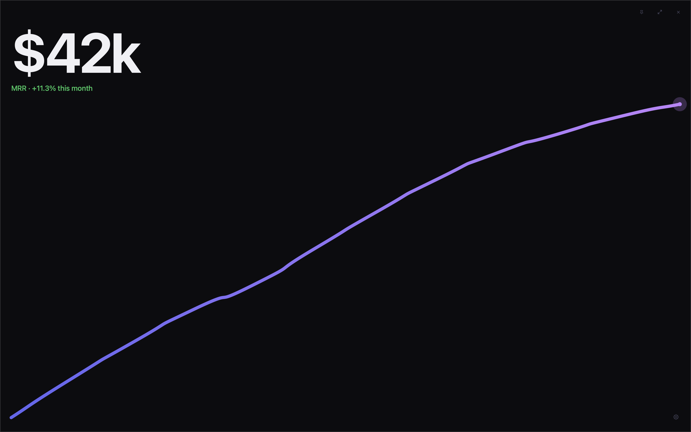

<p align="center">
  
</p>

<h1 align="center">MeowRR</h1>

<p align="center">
  <strong>Minimal MRR tracker</strong><br>
  A small desktop app that connects directly to Stripe
</p>

<p align="center">
  <a href="https://github.com/notacatventures/meowrr/releases/latest">
    
  </a>
</p>

<p align="center">
  
</p>

<p align="center">
  <a href="#get-started">Get started</a> ·
  <a href="#requirements">Requirements</a> ·
  <a href="#what-meowrr-supports">Supported data</a> ·
  <a href="#privacy-and-security">Security</a> ·
  <a href="#opening-meowrr-on-macos">macOS help</a> ·
  <a href="#run-from-source">Run from source</a>
</p>

## Get started

1. [Download the latest release](https://github.com/notacatventures/meowrr/releases/latest) for your computer:
   - macOS: `.dmg`
   - Windows: `.exe`
   - Linux: `.AppImage` or `.deb`
2. Open MeowRR and click the settings button in the bottom-right corner.
3. Paste a restricted Stripe API key with read access to subscriptions, then click **Save**.

Create a restricted key from the [Stripe API keys page](https://dashboard.stripe.com/apikeys). MeowRR only needs read access and never changes your Stripe data.

Revenue refreshes every minute while the app is open and online. Press <kbd>Tab</kbd> to see the keyboard shortcuts.

No Stripe key yet? MeowRR starts with clearly labelled demo data so you can try it safely.

## Requirements

- macOS, Windows, or Linux
- A Stripe account
- A restricted Stripe key that can read subscriptions

## What MeowRR supports

| Works today | Not supported yet |
| --- | --- |
| USD subscriptions | Other or multiple currencies |
| Monthly and annual billing | Other billing intervals |
| Fixed prices | Usage-based or tiered prices |
| Active, paid subscriptions | Discounted subscriptions |

Trials, unpaid subscriptions, and free subscriptions are excluded from the total.

## Privacy and security

> [!IMPORTANT]
> Use a restricted, read-only Stripe key. Never use your full Stripe secret key.

- Your key goes directly from MeowRR to Stripe. It is never sent to JB Bouhier or another server.
- The key is saved locally so you do not need to enter it every time.
- The key is not encrypted on disk in this version.
- If Stripe or your internet connection is unavailable, MeowRR keeps the last successful value on screen and retries automatically.

## Opening MeowRR on macOS

> [!NOTE]
> MeowRR is free and is not notarized by Apple. macOS may block the first launch.

Download MeowRR only from the [official GitHub Releases page](https://github.com/notacatventures/meowrr/releases), then:

1. Try to open MeowRR once and dismiss the warning.
2. Open **System Settings → Privacy & Security**.
3. Find the message that MeowRR was blocked and click **Open Anyway**.
4. Confirm **Open**.

You normally need to do this only once.

## Run from source

<details>
<summary><strong>Show build instructions</strong></summary>
<p></p>
<p></p>

You do not need the source code to use MeowRR. Download the ready-to-use app above unless you specifically want to build it yourself.

Install:

- [Bun](https://bun.sh)
- [Rust](https://rustup.rs)
- The [Tauri prerequisites](https://v2.tauri.app/start/prerequisites/) for your operating system

Then run:

```bash
git clone https://github.com/notacatventures/meowrr.git
cd meowrr
bun install
bun tauri dev
```

The first run may take a few minutes while Rust compiles the app.

Create a production build with:

```bash
bun tauri build
```

Builds are written to `src-tauri/target/release/bundle/`.

Run the test suite with:

```bash
bun run ci
```

Test-only Stripe responses and revenue histories live in `tests/fixtures/` and are not included in the app.

To check the app against a real Stripe account, see [Testing against Stripe](docs/testing-with-stripe.md). It covers seeding a test-mode account with subscriptions, since MeowRR reads `/v1/subscriptions` only and an empty account is indistinguishable from a broken poll.

</details>

<p align="center">
  Made by <a href="https://jbouhier.com">JB Bouhier</a>
</p>
